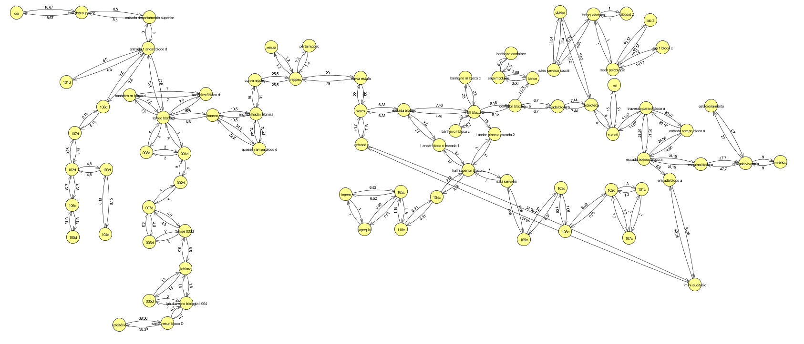

# Rotas-da-UFS

O campus de Itabaiana da UFS possui diversos pontos de interesse como, bibliotecas, laboratórios, auditórios, secretarias de departamentos, sala de professores, areas de convivência,
cantinas, entradas e saídas, estacionamentos, entre outros

## Objetivo

Neste sentido o objetivo principal é dado um ponto de partida encontrar o melhor caminho para um ponto de interesse desejado.

## Metodologia

Para atingir o objetivo proposto, foi utilizado o algoritmo de Dijkstra para encontrar o menor caminho entre dois pontos. O algoritmo de Dijkstra é um algoritmo de busca em grafos que calcula o caminho mais curto de um vértice a todos os outros vértices em um grafo com arestas de peso não negativo. 

O grafo foi construído usando medidas reais que transcrevem a experiência real de um estudante que deseja se locomover no campus de Itabaiana da UFS.

## Execução
    # para executar o codigo so Deus sabe
